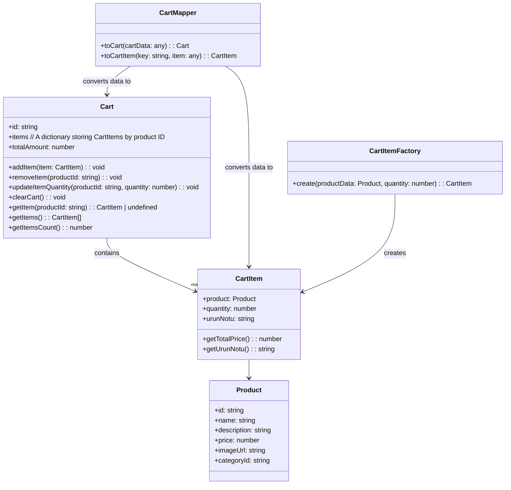
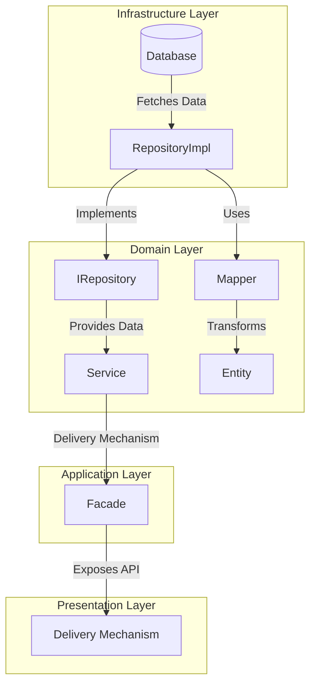
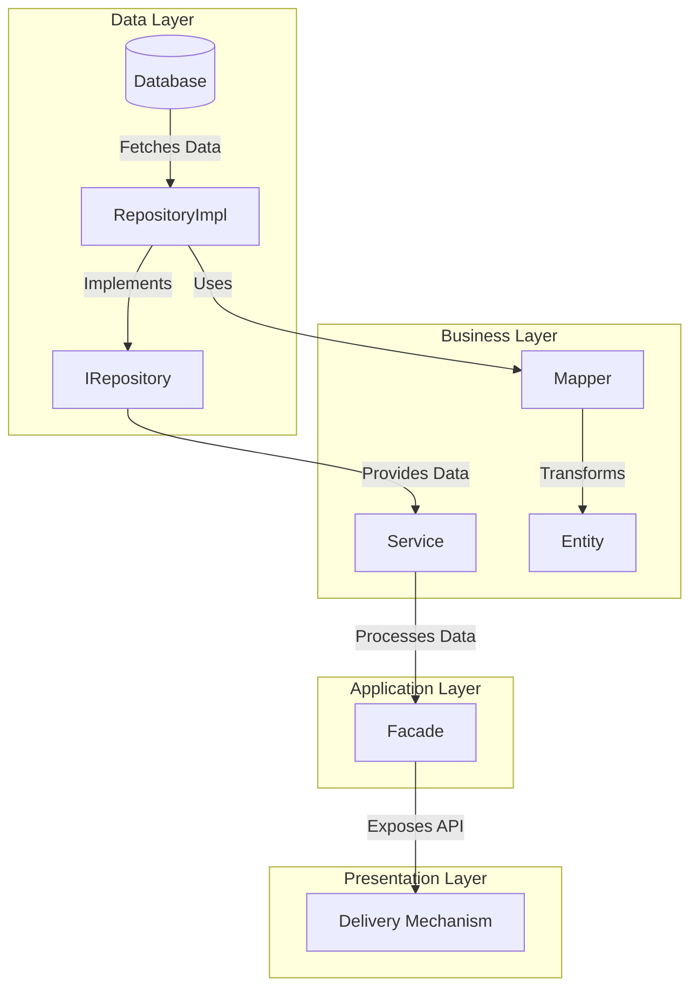

# class diagram

```mermaid
classDiagram
    class Product {
        +id: string
        +name: string
        +description: string
        +price: number
        +imageUrl: string
        +categoryId: string
    }

    class CartItem {
        +product: Product
        +quantity: number
        +urunNotu: string
        +getTotalPrice(): number
        +getUrunNotu(): string
    }

    class Cart {
        +id: string
        +items  // A dictionary storing CartItems by product ID
        +addItem(item: CartItem): void
        +removeItem(productId: string): void
        +updateItemQuantity(productId: string, quantity: number): void
        +clearCart(): void
        +getItem(productId: string): CartItem | undefined
        +getItems(): CartItem[]
        +getItemsCount(): number
        +totalAmount: number
    }

    class CartMapper {
        +toCart(cartData: any): Cart
        +toCartItem(key: string, item: any): CartItem
    }

    class CartItemFactory {
        +create(productData: Product, quantity: number): CartItem
    }

    CartItem --> Product
    Cart --> "many" CartItem : contains
    CartMapper --> Cart : converts data to
    CartMapper --> CartItem : converts data to
    CartItemFactory --> CartItem : creates
```

# data flow diagram second version

```mermaid
graph TD
  subgraph Infrastructure Layer
    DB[(Database)]
    RepoImpl[RepositoryImpl]
  end

  subgraph Domain Layer
    IRepo[IRepository]
    Service[Service]
    Mapper[Mapper]
    Entity[Entity]
  end

  subgraph Application Layer
    Facade[Facade]
  end

  subgraph Presentation Layer
    Delivery[Delivery Mechanism]
  end

  %% Main Flow
  DB -->|Fetches Data| RepoImpl -->|Implements| IRepo
  IRepo -->|Provides Data| Service -->|Delivery Mechanism| Facade -->|Exposes API| Delivery

  %% Side Branch for Mapping
  RepoImpl -->|Uses| Mapper -->|Transforms| Entity
```

# data flow diagram first version

```mermaid
graph TD
  subgraph Data Layer
    DB[(Database)]
    RepoImpl[RepositoryImpl]
    IRepo[IRepository]
  end

  subgraph Business Layer
    IRepo[IRepository]
    Service[Service]
    Mapper[Mapper]
    Entity[Entity]
  end

  subgraph Application Layer
    Facade[Facade]
  end

  subgraph Presentation Layer
    Delivery[Delivery Mechanism]
  end

  %% Main Flow
  DB -->|Fetches Data| RepoImpl -->|Implements| IRepo
  IRepo -->|Provides Data| Service -->|Processes Data| Facade -->|Exposes API| Delivery

  %% Side Branch for Mapping
  RepoImpl -->|Uses| Mapper -->|Transforms| Entity
```