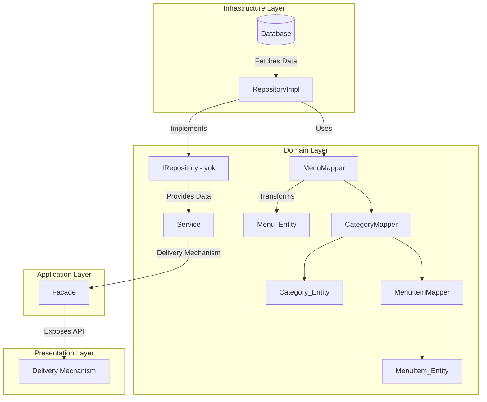

# data flow diagram 

```mermaid
graph TD
  subgraph Infrastructure Layer
    DB[(Database)]
    RepoImpl[RepositoryImpl]
  end

  subgraph Domain Layer
    IRepo[IRepository - yok]
    Service[Service]
    Mapper[MenuMapper]
    Mapper1[CategoryMapper]
    Mapper2[MenuItemMapper]
    Entity[Menu_Entity]
    Entity1[Category_Entity]
    Entity2[MenuItem_Entity]
  end

  subgraph Application Layer
    Facade[Facade]
  end

  subgraph Presentation Layer
    Delivery[Delivery Mechanism]
  end

  %% Main Flow
  DB -->|Fetches Data| RepoImpl -->|Implements| IRepo
  IRepo -->|Provides Data| Service -->|Delivery Mechanism| Facade -->|Exposes API| Delivery

  %% Side Branch for Mapping
  RepoImpl -->|Uses| Mapper -->|Transforms| Entity
  Mapper --> Mapper1 --> Entity1
  Mapper1 --> Mapper2 --> Entity2
```