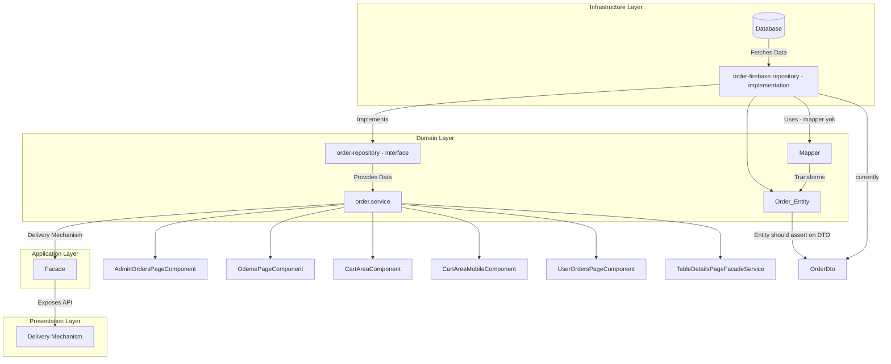

```mermaid
graph TD
  subgraph Infrastructure Layer
    DB[(Database)]
    RepoImpl[order-firebase.repository - implementation]
  end

  subgraph Domain Layer
    IRepo[order-repository - Interface]
    Service[order.service]
    Mapper[Mapper]
    Entity[Order_Entity]
  end

  subgraph Application Layer
    Facade[Facade]
  end

  subgraph Presentation Layer
    Delivery[Delivery Mechanism]
  end

  %% Main Flow
  DB -->|Fetches Data| RepoImpl -->|Implements| IRepo
  IRepo -->|Provides Data| Service -->|Delivery Mechanism| Facade -->|Exposes API| Delivery

Service --> AdminOrdersPageComponent
Service --> OdemePageComponent
Service --> CartAreaComponent
Service --> CartAreaMobileComponent
Service --> UserOrdersPageComponent
Service --> TableDetailsPageFacadeService

  %% Side Branch for Mapping
  RepoImpl -->|Uses - mapper yok| Mapper -->|Transforms| Entity
  RepoImpl -->|currently| OrderDto
  RepoImpl --> Entity --> |Entity should assert on DTO| OrderDto
```