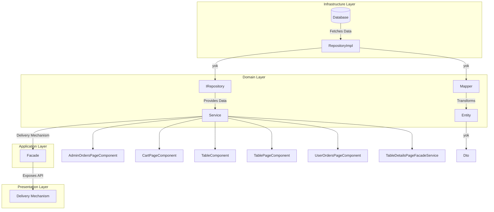

# data flow diagram 

```mermaid
graph TD
  subgraph Infrastructure Layer
    DB[(Database)]
    RepoImpl[RepositoryImpl]
  end

  subgraph Domain Layer
    IRepo[IRepository]
    Service[Service]
    Mapper[Mapper]
    Entity[Entity]
  end

  subgraph Application Layer
    Facade[Facade]
  end

  subgraph Presentation Layer
    Delivery[Delivery Mechanism]
  end

  %% Main Flow
  DB -->|Fetches Data| RepoImpl -->|yok| IRepo
  IRepo -->|Provides Data| Service -->|Delivery Mechanism| Facade -->|Exposes API| Delivery

  %% Side Branch for Mapping
  RepoImpl -->|yok| Mapper -->|Transforms| Entity

  Entity -->|yok| Dto

Service --> AdminOrdersPageComponent
Service --> CartPageComponent
Service --> TableComponent
Service --> TablePageComponent
Service --> UserOrdersPageComponent
Service --> TableDetailsPageFacadeService
```
